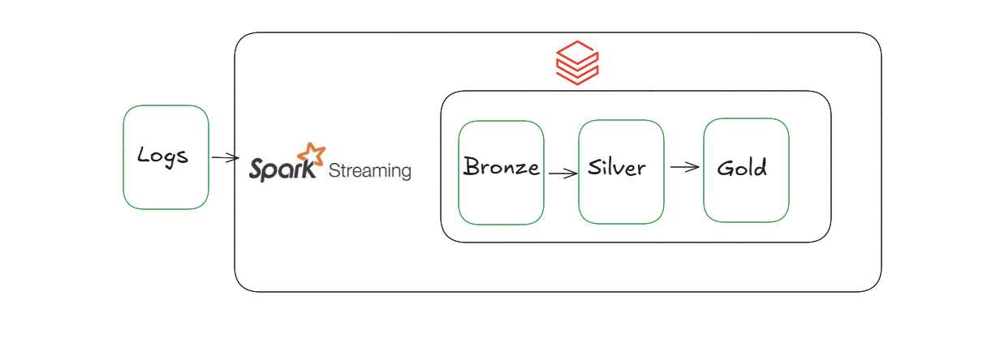
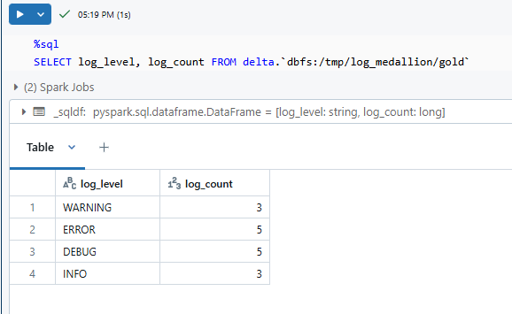

## **Realtime Log Analytics with Spark Streaming and Delta Lake**

### **Project Overview**
This project implements a real-time log analytics pipeline using PySpark, Spark Structured Streaming, and Delta Lake on Databricks. The pipeline follows a Medallion (Bronze-Silver-Gold) architecture, enabling efficient data ingestion, transformation, and aggregation for log data. It’s designed to process and analyze logs at scale, providing insights such as log counts by severity level.

### **Key Features**
- **Real-time Streaming**: Processes log data in real-time using Spark Structured Streaming.
- **Medallion Architecture**: Data flows through Bronze (raw), Silver (cleaned), and Gold (aggregated) layers for organized, incremental data transformation.
- **Delta Lake Integration**: Enables ACID transactions, data versioning, and scalable data storage.
- **Scalable and Extensible**: Built to handle large volumes of log data and customizable for additional analytics or transformations.

### **Architecture**
  

1. **Bronze Layer**: Ingests raw log data in JSON format.
2. **Silver Layer**: Cleans and adds processing timestamps.
3. **Gold Layer**: Aggregates data by log level for easy insights and visualization.

### **Technologies Used**
- **Apache Spark**: Streaming, transformation, and aggregation.
- **Delta Lake**: Data lake storage layer to handle data versioning and ACID compliance.
- **Databricks**: Unified data analytics platform, simplifying Spark setup and streamlining development.
- **Python**: Core programming language for pipeline logic and orchestration.

### **Project Structure**
```plaintext
realtime-log-analytics/
├── config/
│   └── config.py                # Configuration file with paths and settings
├── logs/
│   └── generate_logs.py         # Script to generate sample log data
├── src/main/
│   ├── log_streaming_pipeline.py # Bronze layer: data ingestion,  Silver layer: data transformation and Gold layer: data aggregation
├── tests/
│   └── test_pipeline.py         # Unit tests for each layer
└── README.md                    # Project documentation
```

### **Setup Instructions**
1. **Environment Setup**:
   - Install PySpark, Delta Lake, and other dependencies.
   - If using Databricks, configure a cluster and upload the project files.

2. **Configuration**:
   - Edit `config/config.py` to specify file paths for log data and Delta tables.
  
3. **Run the Pipeline**:
   - run the pipeline end-to-end using `test_pipeline.py`.

### **Sample Output**
After running the pipeline, you can query the Gold table for insights. Example:

  

```sql
SELECT log_level, log_count FROM delta.`dbfs:/tmp/log_medallion/gold`
```

### **Testing**
- Run `tests/test_pipeline.py` to verify each layer processes data correctly.
- Simulate different log levels and analyze the final Gold table for expected log counts.

### **Conclusion**
This project demonstrates a scalable and efficient approach to real-time log analytics using Spark Streaming and Delta Lake, aligned with industry-standard Medallion architecture. It can be expanded to meet various analytics requirements, making it suitable for production-grade logging systems.
